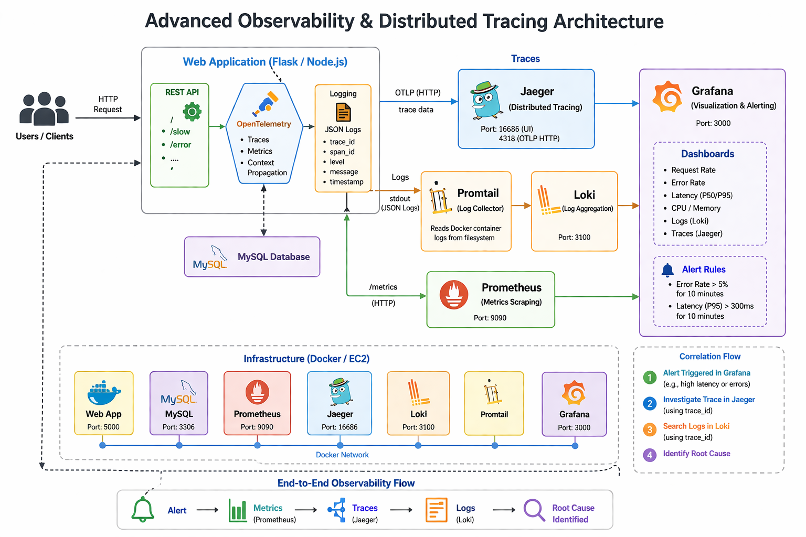
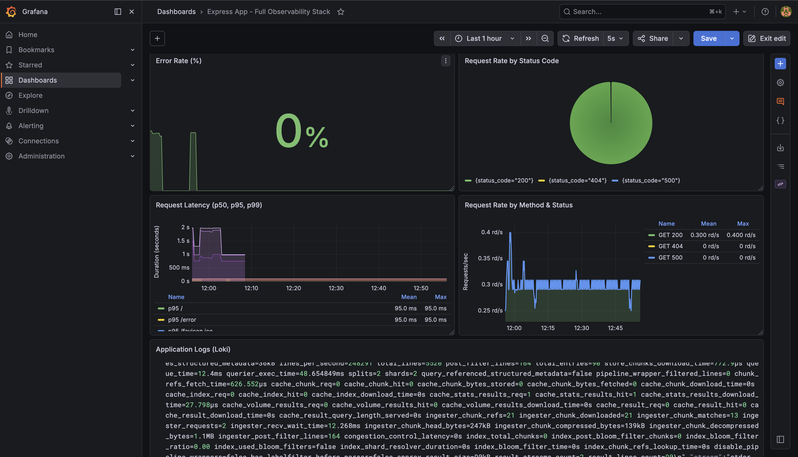
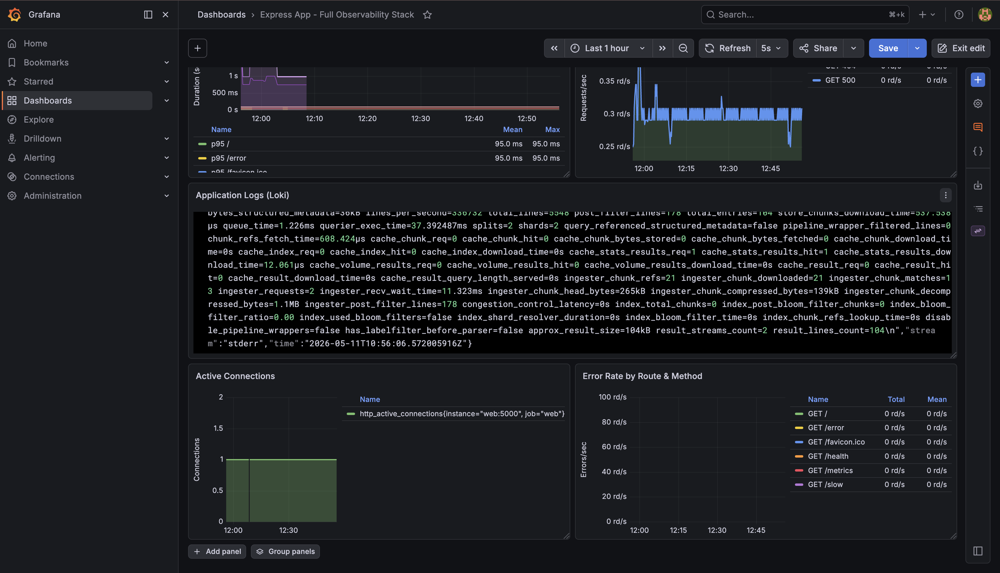
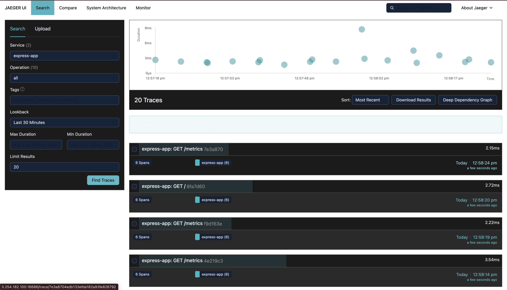
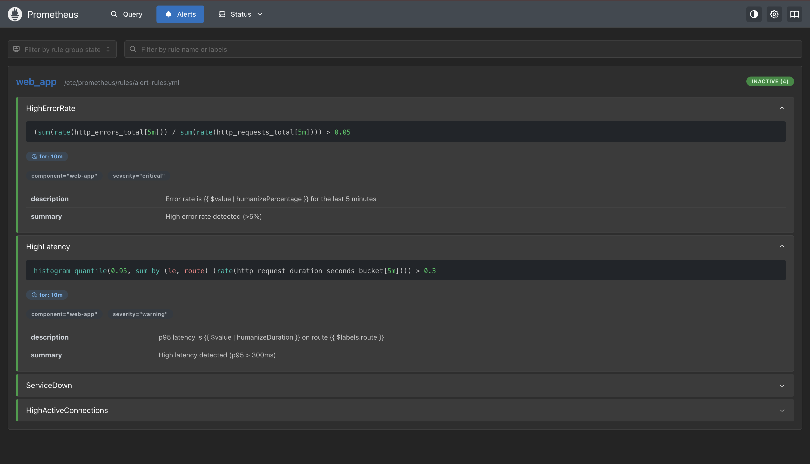

# Advanced Monitoring — Node.js + MySQL + Full Observability Stack on EC2

> Provision an EC2 instance with Terraform (modules), configure it with Ansible (roles), and deploy a two-tier Node.js + MySQL application with a full observability stack — metrics (Prometheus), logs (Loki + Grafana Alloy), traces (Jaeger), alerting (Alertmanager), and dashboards (Grafana) — all via Docker Compose.


---

## Prerequisites

| Tool           | Version   | Check                     |
|----------------|-----------|---------------------------|
| Terraform      | >= 1.5.0  | `terraform -v`            |
| Ansible        | >= 2.14   | `ansible --version`       |
| AWS CLI        | any       | `aws --version`           |
| Docker         | >= 25     | `docker --version`        |
| Docker Compose | v2        | `docker compose version`  |

Configure AWS credentials:
```bash
aws configure
# AWS Access Key ID:     <your-key-id>
# AWS Secret Access Key: <your-secret-key>
# Default region:        us-east-1
```

---

## How It Works

```
┌──────────────────────────────────────────────────────────────────┐
│  LOCAL MACHINE                                                   │
│                                                                  │
│  backend-setup/                                                  │
│    └── creates S3 bucket + DynamoDB table for remote state       │
│                                                                  │
│  terraform apply                                                 │
│    ├── module: keypair       → RSA key pair + .pem file          │
│    ├── module: security_group → SG with ports 22, 5000, 3000,    │
│    │                           9090, 9093, 16686, 3100, 12345    │
│    ├── module: ec2           → t3.small Amazon Linux 2           │
│    └── local_file            → writes ansible/inventory.ini      │
│                                                                  │
│  ansible-playbook playbook.yml                                   │
│    ├── role: bootstrap  → Python 3.9 from source (raw SSH)       │
│    ├── role: docker     → Docker + Compose v2 + group reset      │
│    └── role: deploy     → rsync app files, compose up, verify    │
└──────────────────────────────────────────────────────────────────┘
                             │
                             ▼
              ┌──────────────────────────────────┐
              │  AWS EC2 (us-east-1)             │
              │  Amazon Linux 2 / t3.small       │
              │                                  │
              │  ┌───────────────────────────┐   │
              │  │  Application Layer        │   │
              │  │  web (Node.js)  :5000 ────┼──→│
              │  │  db  (MySQL 8)  :3306     │   │
              │  └───────────────────────────┘   │
              │                                  │
              │  ┌───────────────────────────┐   │
              │  │  Observability Stack      │   │
              │  │  Prometheus     :9090     │   │
              │  │  Alertmanager   :9093     │   │
              │  │  Loki           :3100     │   │
              │  │  Alloy          :12345    │   │
              │  │  Jaeger         :16686    │   │
              │  │  Grafana        :3000     │   │
              │  └───────────────────────────┘   │
              └──────────────────────────────────┘
```

**Observability signals produced by the Node.js app:**

- **Metrics** — Prometheus-compatible `/metrics` endpoint using `prom-client` (RED pattern: rate, errors, duration)
- **Traces** — OpenTelemetry SDK auto-instruments HTTP, Express, and MySQL2; exports to Jaeger via OTLP/HTTP
- **Logs** — Structured JSON logs via Winston; collected by Grafana Alloy and shipped to Loki; each log entry includes `trace_id` and `span_id` for correlation

---

## Docker Compose Services

| Service        | Image                           | Port(s)                   | Role                              |
|----------------|---------------------------------|---------------------------|-----------------------------------|
| `web`          | Custom (Node.js 18 Alpine)      | `5000:5000`               | Express REST API + observability  |
| `db`           | `mysql:8.0`                     | internal `3306`           | MySQL database                    |
| `prometheus`   | `prom/prometheus:latest`        | `9090:9090`               | Metrics scraping + alerting rules |
| `alertmanager` | `prom/alertmanager:latest`      | `9093:9093`               | Alert routing (critical/warning)  |
| `loki`         | `grafana/loki:latest`           | `3100:3100`               | Log aggregation and storage       |
| `alloy`        | `grafana/alloy:latest`          | `12345:12345`             | Collects Docker container logs    |
| `jaeger`       | `jaegertracing/all-in-one`      | `16686:16686`, `4318:4318`| Distributed tracing UI + OTLP     |
| `grafana`      | `grafana/grafana:latest`        | `3000:3000`               | Unified dashboard (auto-provisioned) |

All services share a `monitoring` bridge network.

---

## Application Endpoints

| Endpoint   | Method | Description                                          |
|------------|--------|------------------------------------------------------|
| `GET /`    | GET    | Health check — returns status and timestamp          |
| `GET /users` | GET  | Fetches all users from MySQL                         |
| `GET /health` | GET | Verifies database connectivity                      |
| `GET /slow` | GET   | Simulates a slow request (500–2000ms) for latency testing |
| `GET /error` | GET  | Simulates a 500 error for alert testing              |
| `GET /metrics` | GET | Prometheus metrics endpoint                       |

---

## Prometheus Alert Rules

| Alert                  | Condition                          | Severity | Window |
|------------------------|------------------------------------|----------|--------|
| `HighErrorRate`        | Error rate > 5% over 5m            | critical | 10m    |
| `HighLatency`          | p95 latency > 300ms on any route   | warning  | 10m    |
| `ServiceDown`          | `up{job="web"} == 0`               | critical | 1m     |
| `HighActiveConnections`| Active connections > 100           | warning  | 5m     |

Alertmanager routes critical alerts every 5 minutes and warning alerts every 30 minutes.

Grafana Alloy handles log collection and forwards Docker container logs to Loki.

---

## Grafana

Access Grafana at `http://<public-ip>:3000` (default login: `admin` / `admin`).

Datasources are auto-provisioned:
- **Prometheus** — metrics
- **Loki** — logs (with trace correlation via `trace_id`)
- **Jaeger** — traces

A pre-built dashboard is automatically loaded under the `Monitoring` folder.

---

## Step-by-Step Execution

### 1 — Create backend resources

```bash
cd backend-setup/
terraform init
terraform plan
terraform apply
# note the bucket name from output
```

### 2 — Update backend block in `terraform/main.tf`

```hcl
backend "s3" {
  bucket       = "<bucket-name-from-output>"
  key          = "advanced-monitoring/terraform.tfstate"
  region       = "us-east-1"
  use_lockfile = true
}
```

### 3 — Apply Terraform

```bash
cd ../terraform/
terraform init
terraform plan
terraform apply
```

### 4 — Wait for SSH

```bash
IP=$(terraform output -raw instance_public_ip)
until nc -zw3 "$IP" 22; do echo "waiting..."; sleep 5; done
echo "SSH ready"
```

### 5 — Run Ansible

```bash
cd ../ansible/
ansible-playbook -i inventory.ini playbook.yml
```

Ansible will:
1. **bootstrap** — compile and install Python 3.9 from source (~3–5 min, skipped on re-runs)
2. **docker** — install Docker and Docker Compose v2, reset SSH connection for group changes
3. **deploy** — rsync app files to EC2, run `docker compose up -d --build`, verify HTTP 200

### 6 — Verify Application

```bash
curl http://$IP:5000
curl http://$IP:5000/users
curl http://$IP:5000/health
```

### 7 — Access Observability UIs

| UI           | URL                           |
|--------------|-------------------------------|
| Grafana      | `http://<ip>:3000`            |
| Prometheus   | `http://<ip>:9090`            |
| Alertmanager | `http://<ip>:9093`            |
| Jaeger       | `http://<ip>:16686`           |
| Alloy        | `http://<ip>:12345`           |

### 8 — Run Load Test

```bash
cd app/
./load-test.sh http://$IP:5000
```

This generates traffic across all endpoints to populate Grafana dashboards and trigger alerts.

### 9 — Cleanup

```bash
# bring down containers on EC2
ssh -i docker-app-key.pem ec2-user@$IP "cd app && docker compose down --volumes"

# destroy AWS resources
cd ../terraform/
terraform destroy
```

---

## Ansible Roles

| Role        | Purpose                                                                                       |
|-------------|-----------------------------------------------------------------------------------------------|
| `bootstrap` | Installs Python 3.9 from source using `raw` module — idempotent via `test -f` guards         |
| `docker`    | Installs Docker via `amazon-linux-extras`, Docker Compose v2, resets SSH connection after adding `ec2-user` to docker group |
| `deploy`    | Rsyncs `app/` to EC2, runs `docker compose up -d --build`, waits for HTTP 200, saves logs    |

---

## Terraform Modules

| Module           | Resources                                                          |
|------------------|--------------------------------------------------------------------|
| `keypair`        | `tls_private_key`, `local_sensitive_file`, `aws_key_pair`          |
| `security_group` | `aws_security_group`, ingress rules (22, 5000, 3000, 9090, 9093, 16686, 3100, 12345), egress rule |
| `ec2`            | `data.aws_ami`, `aws_instance`                                     |

---

## Outputs

```
instance_public_ip    = "x.x.x.x"
instance_public_dns   = "ec2-x-x-x-x.compute-1.amazonaws.com"
app_url               = "http://x.x.x.x:5000"
ssh_connect_command   = "ssh -i docker-app-key.pem ec2-user@x.x.x.x"
```

---

## Troubleshooting

| Error | Cause | Fix |
|---|---|---|
| `address already in use :5000` | AirPlay Receiver on Mac | System Settings → AirDrop & Handoff → AirPlay Receiver → OFF |
| `Cannot find module mysql2` | Image not rebuilt | `docker compose down && docker compose up --build` |
| `Timeout waiting for privilege escalation` | `become: true` on copy task | Add `become: false` to copy task |
| `docker: permission denied` | ec2-user not in docker group yet | `meta: reset_connection` after adding user to group |
| `Connection refused` on wait task | `localhost` resolves to Mac not EC2 | Use `ansible_host` instead of `localhost` in uri module |
| `No changes` on destroy | Wrong directory | Always run `terraform destroy` from `terraform/` folder |
| Grafana shows no data | Alloy can't read Docker container logs | Ensure `/var/lib/docker/containers` is mounted read-only and Alloy runs as `root` |
| Loki returns `entry too far behind` | Old log samples rejected | Adjust `reject_old_samples_max_age` in `loki-config.yml` |

---

## Tools & Versions

- Terraform `>= 1.5.0` — [terraform.io](https://www.terraform.io)
- Ansible `>= 2.14` — [ansible.com](https://www.ansible.com)
- Docker `>= 25` — [docker.com](https://www.docker.com)
- Docker Compose `v2` — [docs.docker.com](https://docs.docker.com/compose)
- AWS Provider `~> 5.0` — [registry.terraform.io](https://registry.terraform.io/providers/hashicorp/aws/latest)
- Node.js `18 Alpine` — [hub.docker.com](https://hub.docker.com/_/node)
- MySQL `8.0` — [hub.docker.com](https://hub.docker.com/_/mysql)
- Prometheus `latest` — [prometheus.io](https://prometheus.io)
- Grafana `latest` — [grafana.com](https://grafana.com)
- Loki `latest` — [grafana.com/oss/loki](https://grafana.com/oss/loki)
- Jaeger `latest` — [jaegertracing.io](https://www.jaegertracing.io)
- OpenTelemetry Node.js SDK — [opentelemetry.io](https://opentelemetry.io)

---

## Screenshots

### Grafana Output



### Jaeger


### Prometheus


### Browser — /users


### Browser — /health


---

## Author

Furaha Justine
