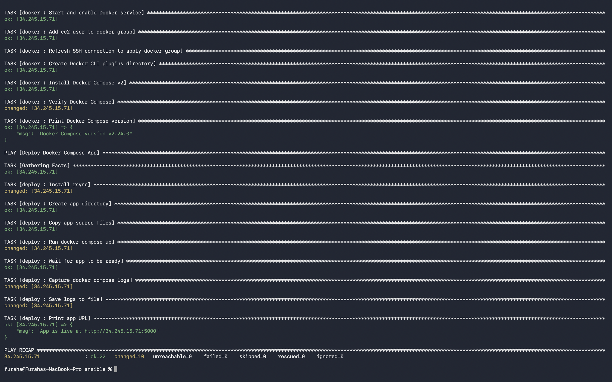
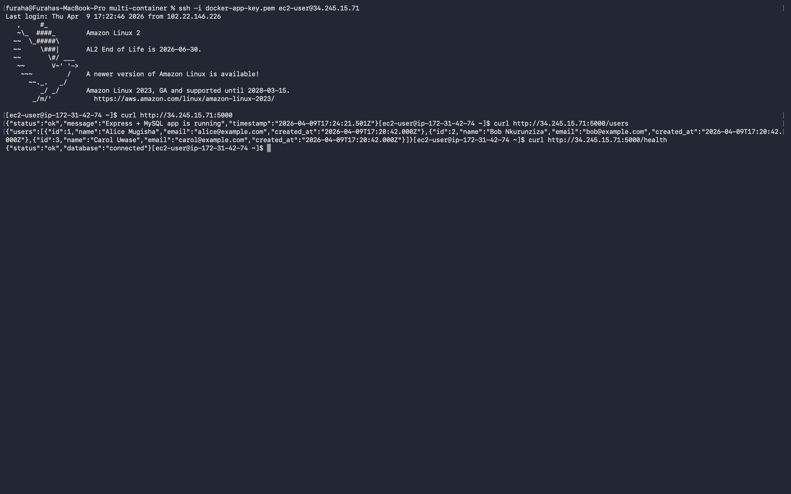
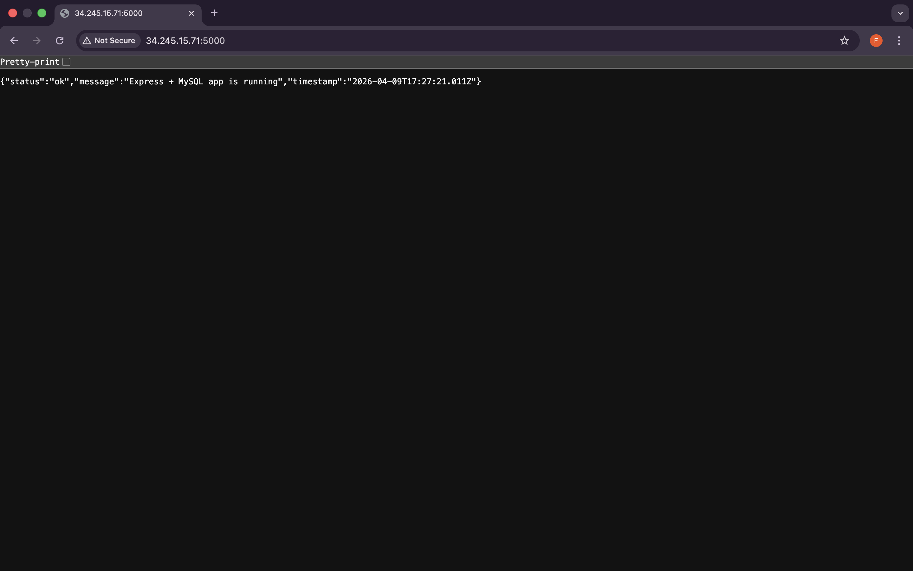
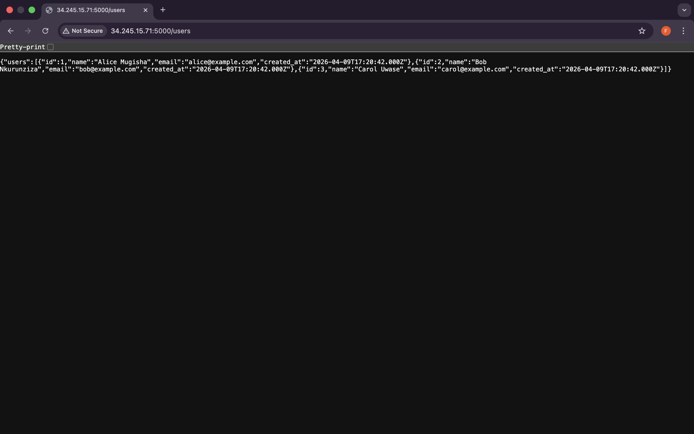
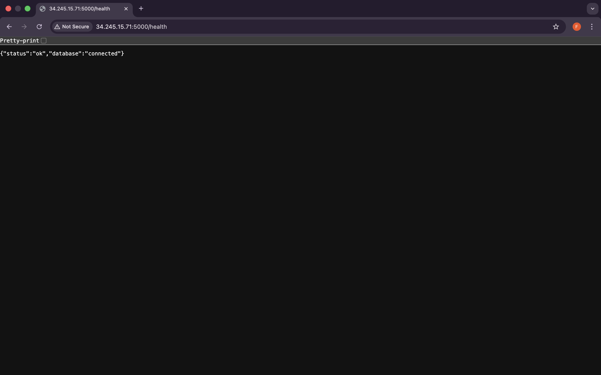

# Docker Compose — Two-Tier Node.js + MySQL on EC2

> Provision an EC2 instance with Terraform (modules), configure it with Ansible (roles), and deploy a two-tier Node.js + MySQL application using Docker Compose.

---

## Repository Structure

```
multi-container/
├── terraform/
│   ├── main.tf                        # Root module — calls child modules
│   ├── variables.tf                   # Input variables
│   ├── outputs.tf                     # Public IP, app URL, SSH command
│   ├── inventory.tftpl                # Template for Ansible inventory
│   └── modules/
│       ├── keypair/
│       │   ├── main.tf                # tls_private_key, local_sensitive_file, aws_key_pair
│       │   ├── variables.tf
│       │   └── outputs.tf
│       ├── security_group/
│       │   ├── main.tf                # aws_security_group + ingress/egress rules
│       │   ├── variables.tf
│       │   └── outputs.tf
│       └── ec2/
│           ├── main.tf                # data aws_ami + aws_instance
│           ├── variables.tf
│           └── outputs.tf
├── backend-setup/
│   ├── main.tf                        # S3 bucket + DynamoDB table for remote state
│   └── outputs.tf
├── ansible/
│   ├── ansible.cfg                    # Ansible defaults
│   ├── inventory.ini                  # Auto-generated by Terraform
│   ├── playbook.yml                   # Entry point
│   └── roles/
│       ├── bootstrap/
│       │   └── tasks/main.yml         # Python 3.9 install from source
│       ├── docker/
│       │   └── tasks/main.yml         # Docker + Docker Compose v2 install
│       └── deploy/
│           └── tasks/main.yml         # Copy files, docker compose up, verify
├── app/
│   ├── docker-compose.yml             # Two services: web + db
│   ├── web/
│   │   ├── app.js                     # Express REST API
│   │   ├── package.json               # Node.js dependencies
│   │   └── Dockerfile                 # Node.js 18 Alpine image
│   └── db/
│       └── init.sql                   # Schema + seed data
├── .gitignore
└── README.md
```

---

## Prerequisites

| Tool      | Version   | Check                  |
|-----------|-----------|------------------------|
| Terraform | >= 1.5.0  | `terraform -v`         |
| Ansible   | >= 2.14   | `ansible --version`    |
| AWS CLI   | any       | `aws --version`        |

Configure AWS credentials:
```bash
aws configure
# AWS Access Key ID:     <your-key-id>
# AWS Secret Access Key: <your-secret-key>
# Default region:        us-east-1
```

---

## How It Works

```
┌──────────────────────────────────────────────────────────────────┐
│  LOCAL MACHINE                                                   │
│                                                                  │
│  backend-setup/                                                  │
│    └── creates S3 bucket + DynamoDB table for remote state       │
│                                                                  │
│  terraform apply                                                 │
│    ├── module: keypair       → RSA key pair + .pem file          │
│    ├── module: security_group → SG with port 22 + 5000           │
│    ├── module: ec2           → t3.micro Amazon Linux 2           │
│    └── local_file            → writes ansible/inventory.ini      │
│                                                                  │
│  ansible-playbook playbook.yml                                   │
│    ├── role: bootstrap  → Python 3.9 from source (raw SSH)       │
│    ├── role: docker     → Docker + Compose v2 + group reset      │
│    └── role: deploy     → rsync app files, compose up, verify    │
└──────────────────────────────────────────────────────────────────┘
                             │
                             ▼
                 ┌───────────────────────┐
                 │  AWS EC2 (us-east-1)  │
                 │  Amazon Linux 2       │
                 │  t3.micro             │
                 │                       │
                 │  ┌─────────────────┐  │
                 │  │  web (Node.js)  │──┼─→ :5000
                 │  │  Express API    │  │
                 │  └────────┬────────┘  │
                 │           │           │
                 │  ┌────────▼────────┐  │
                 │  │  db (MySQL 8.0) │  │
                 │  │  appdb          │  │
                 │  └─────────────────┘  │
                 └───────────────────────┘
```

---

## Application Endpoints

| Endpoint | Description |
|---|---|
| `GET /` | Health check — returns status and timestamp |
| `GET /users` | Fetches all users from MySQL |
| `GET /health` | Verifies database connectivity |

---

## Step-by-Step Execution

### 1 — Create backend resources

```bash
cd backend-setup/
terraform init
terraform plan
terraform apply
# note the bucket name from output
```

### 2 — Update backend block in `terraform/main.tf`

```hcl
backend "s3" {
  bucket       = "<bucket-name-from-output>"
  key          = "docker-app/terraform.tfstate"
  region       = "us-east-1"
  use_lockfile = true
}
```

### 3 — Apply Terraform

```bash
cd ../terraform/
terraform init
terraform plan
terraform apply
```

### 4 — Wait for SSH

```bash
IP=$(terraform output -raw instance_public_ip)
until nc -zw3 "$IP" 22; do echo "waiting..."; sleep 5; done
echo "SSH ready"
```

### 5 — Run Ansible

```bash
cd ../ansible/
ansible-playbook -i inventory.ini playbook.yml
```

Ansible will:
1. **bootstrap** — compile and install Python 3.9 from source (~3-5 min, skipped on re-runs)
2. **docker** — install Docker and Docker Compose v2, reset SSH connection for group changes
3. **deploy** — rsync app files to EC2, run `docker compose up -d --build`, verify HTTP 200

### 6 — Verify

```bash
curl http://$IP:5000
curl http://$IP:5000/users
curl http://$IP:5000/health
```

Open `http://<public-ip>:5000` in browser and take a screenshot.

### 7 — Cleanup

```bash
# bring down containers on EC2
ssh -i docker-app-key.pem ec2-user@$IP "cd app && docker compose down --volumes"

# destroy AWS resources
cd ../terraform/
terraform destroy 
```

---

## Docker Compose Services

| Service | Image | Port | Role |
|---|---|---|---|
| `web` | Custom (Node.js 18 Alpine) | `5000:5000` | Express REST API |
| `db` | `mysql:8.0` | internal `3306` | MySQL database |

- `web` depends on `db` with `healthcheck` condition — starts only after MySQL is ready
- `db_data` volume persists MySQL data across container restarts
- `init.sql` runs automatically on first MySQL boot via `/docker-entrypoint-initdb.d/`

---

## Ansible Roles

| Role | Purpose |
|---|---|
| `bootstrap` | Installs Python 3.9 from source using `raw` module — idempotent via `test -f` guards |
| `docker` | Installs Docker via `amazon-linux-extras`, Docker Compose v2, resets SSH connection after adding `ec2-user` to docker group |
| `deploy` | Rsyncs `app/` to EC2, runs `docker compose up -d --build`, waits for HTTP 200, saves logs |

---

## Terraform Modules

| Module | Resources |
|---|---|
| `keypair` | `tls_private_key`, `local_sensitive_file`, `aws_key_pair` |
| `security_group` | `aws_security_group`, ingress rules (22, 5000), egress rule |
| `ec2` | `data.aws_ami`, `aws_instance` |

---

## Outputs

```
instance_public_ip    = "x.x.x.x"
instance_public_dns   = "ec2-x-x-x-x.compute-1.amazonaws.com"
app_url               = "http://x.x.x.x:5000"
ssh_connect_command   = "ssh -i docker-app-key.pem ec2-user@x.x.x.x"
```

---

## 📸 Screenshots

The `screenshots/` folder contains evidence of:

### Ansible Playbook Output
 
### curl Verification
   
### Browser Screenshot
   
   
   
### curl Verification
   

## Troubleshooting

| Error | Cause | Fix |
|---|---|---|
| `address already in use :5000` | AirPlay Receiver on Mac | System Settings → AirDrop & Handoff → AirPlay Receiver → OFF |
| `Cannot find module mysql2` | Image not rebuilt | `docker compose down && docker compose up --build` |
| `Timeout waiting for privilege escalation` | `become: true` on copy task | Add `become: false` to copy task |
| `docker: permission denied` | ec2-user not in docker group yet | `meta: reset_connection` after adding user to group |
| `Connection refused` on wait task | `localhost` resolves to Mac not EC2 | Use `ansible_host` instead of `localhost` in uri module |
| `No changes` on destroy | Wrong directory | Always run `terraform destroy` from `terraform/` folder |
| `InvalidBucketName` | Placeholder bucket name in backend | Run `backend-setup/` first, use real bucket name |

---

## Tools & Versions

- Terraform `>= 1.5.0` — [terraform.io](https://www.terraform.io)
- Ansible `>= 2.14` — [ansible.com](https://www.ansible.com)
- Docker `>= 25` — [docker.com](https://www.docker.com)
- Docker Compose `v2.24.0` — [docs.docker.com](https://docs.docker.com/compose)
- AWS Provider `~> 5.0` — [registry.terraform.io](https://registry.terraform.io/providers/hashicorp/aws/latest)
- Node.js `18 Alpine` — [hub.docker.com](https://hub.docker.com/_/node)
- MySQL `8.0` — [hub.docker.com](https://hub.docker.com/_/mysql)

## 👨‍💻 Author

Furaha Justine